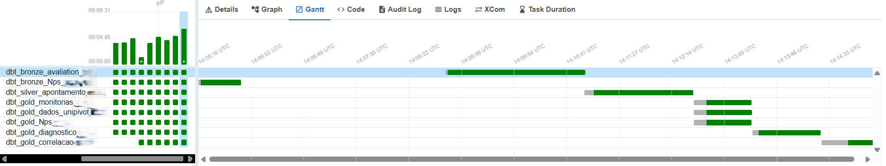
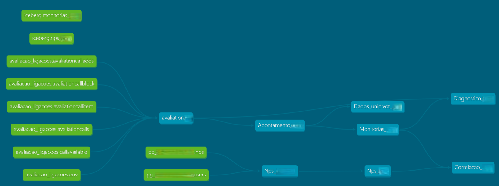

# 🚀 Modern Data Platform: SQL Server to Lakehouse

## 📌 Overview

This project represents the migration of a legacy data pipeline based on SQL Server stored procedures into a modern lakehouse architecture.

The objective was to improve scalability, reliability, and performance of analytical workflows.

---

## 🧩 Problem

The original architecture relied on:

* SQL Server stored procedures
* File-based integrations (SMB/SFTP)
* Distributed and hard-coded business logic

This resulted in:

* Low scalability
* Difficult maintenance
* Limited data governance
* High processing time

---

## 🏗️ Solution

A modern data stack was implemented using:

* **Airflow** → workflow orchestration
* **dbt** → data transformations and modeling
* **Trino** → distributed query engine
* **Iceberg** → analytical table format
* **MinIO** → object storage

The data was structured into layers:

* **Bronze** → raw data ingestion
* **Silver** → cleaned and standardized data
* **Gold** → business-ready datasets

---

## 🔄 Data Flow

Sources → Trino → Bronze → Silver → Gold → Analytics
↑
Airflow

## 📈 Pipeline Visualization

This section illustrates the orchestration and transformation layers of the pipeline.

### Airflow DAG Execution (Gantt View)

### dbt Lineage

## 📊 Key Use Case

A pipeline combining:

* Quality monitoring data
* Customer satisfaction (NPS)

Used to generate:

* Operational performance indicators
* Diagnostic analysis
* Correlation between service quality and customer satisfaction

---

## ⚡ Performance Improvement

| Scenario            | Processing Time |
| ------------------- | --------------- |
| Legacy (SQL Server) | 1h43            |
| Lakehouse           | 28 min          |

🚀 **2.6x faster processing**

---

## 🧠 Technical Decisions

* Replaced stored procedures with **dbt models**
* Centralized business logic and versioning
* Used **Iceberg** for scalable analytical tables
* Used **Trino** to query multiple data sources
* Implemented orchestration with **Airflow**

---

## ⚠️ Challenges

* Migrating complex SQL logic from procedures
* Standardizing inconsistent data
* Handling joins across heterogeneous sources
* Optimizing distributed queries

---

## 📌 Results

* Significant reduction in processing time
* Improved data reliability
* Increased scalability
* Faster access to analytical insights

---

## 🛠️ Tech Stack

* Airflow
* dbt
* Trino
* Iceberg
* MinIO
* PostgreSQL

---

## 🔒 Disclaimer

This project is a **technical representation** of a real-world scenario.
All data, structures, and names were generalized to preserve confidentiality.
